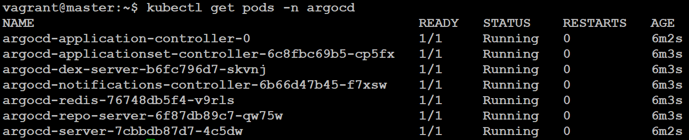
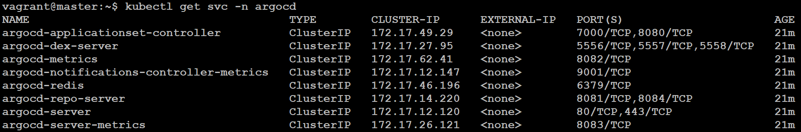
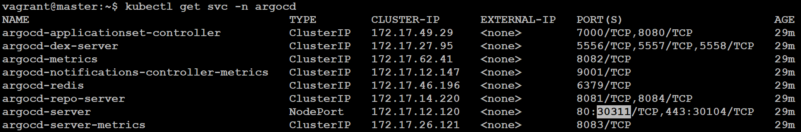
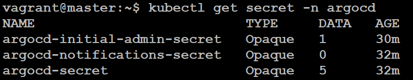

# 2.1: Installation Methods

## 1. Installation using Kubernetes manifests

- Link - https://argo-cd.readthedocs.io/en/stable/getting_started/

### STEP 1: Install Argo CD

```bash
kubectl create namespace argocd
kubectl apply -n argocd -f https://raw.githubusercontent.com/argoproj/argo-cd/stable/manifests/install.yaml
```

- It will create a namespace called "argocd".
- and apply all the manifest files.

- Watch the pods being created: `kubectl get pods -n argocd -w`, `-w` to watch.



#### Here's a brief explanation of each pod based on its name:

1.  **argocd-application-controller-0**:

    - Manages and controls applications deployed within the ArgoCD instance.
    - Handles tasks such as syncing application state with desired state and managing application lifecycle operations.

2.  **argocd-applicationset-controller-6c8fbc69b5-cp5fx**:

    - Possibly manages ApplicationSets within ArgoCD.
    - Allows defining a set of similar applications to be managed collectively, typically with shared configuration or parameters.

3.  **argocd-dex-server-b6fc796d7-skvnj**:

    - Hosts the Dex server, an OpenID Connect (OIDC) identity provider used by ArgoCD.
    - Provides authentication services, allowing users to log in using various identity providers like LDAP, GitHub, or Google.

4.  **argocd-notifications-controller-6b66d47b45-f7xsw**:

    - Manages notifications within ArgoCD.
    - Sends notifications to users or external systems based on events or triggers within ArgoCD, such as application deployment status changes.

5.  **argocd-redis-76748db5f4-v9rls**:

    - Hosts the Redis server, a key-value store used by ArgoCD for caching and storing operational data.
    - Enhances performance by providing fast data retrieval and temporary data storage for ArgoCD operations.

6.  **argocd-repo-server-6f87db89c7-qw75w**:

    - Hosts the ArgoCD Repository Server.
    - Manages Git repositories containing Kubernetes manifests of applications deployed by ArgoCD.
    - Syncs repository contents, detects changes, and manages application manifests stored in Git repositories.

7.  **argocd-server-7cbbdb87d7-4c5dw**:

    - Hosts the main ArgoCD server, providing the user interface (UI) and API endpoint.
    - Handles user authentication, application visualization, configuration management, and core functionalities of ArgoCD.

### STEP 2: Changing service type of `argocd-server` to Use the UI

- Default is `ClusterIP`, changing to `NodePort`.

- View all the SVC in argocd namespace: `kubectl get svc -n argocd`



- To change edit the manifest: `kubectl edit svc argocd-server -n argocd`



- Now you can access the UI `<IP:PORT>`.

### STEP 3: Password

- View all the secret in the namespace: `kubectl get secret -n argocd`.



- Initial Password is in: `kubectl edit secret argocd-initial-admin-secret -n argocd`

- Copy the Encoded password and decode it.
- **Username**: **admin**
- **Password** : `echo SkhpQTBtcWh5ejUtV0FxQw== | base64 --decode`
